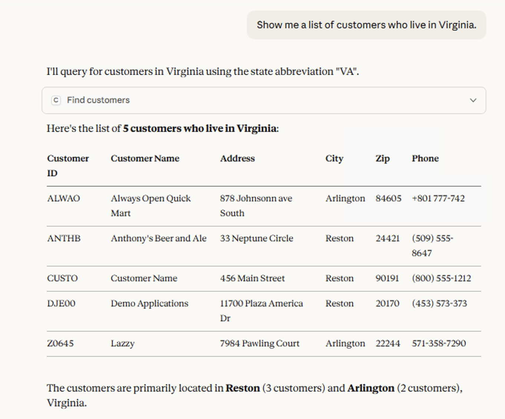

## Table of Contents

- [Overview](#connx-mcp-server)
- [Sample Features](#features)
- [Installation](#installation)
- [Testing](#testing)
- [Usage](#usage)
- [MCP Tools](#mcp-tools)
  - [`query_connx`](#query_connx)
  - [`update_connx`](#update_connx)
  - [`find_customers`](#find_customers)
- [MCP Client Examples](#mcp-client-examples)
- [Extending MCP Tools](#extending-mcp-tools)
- [Summary](#summary)
- [What is MCP?](#what-is-mcp)


## CONNX MCP Server

This project is a demonstration and reference implementation intended to show how an MCP server can be structured, configured, and hosted locally to enable AI-assisted access to CONNX data.

The server is not intended to be a complete or hardened production solution. Instead, it provides a focused, minimal example of MCP concepts, including tool definitions, resource exposure, ANSI SQL-92 query patterns, and safe interaction with legacy data sources.


## Features
- ODBC connection to CONNX for unified database access.
- MCP tools: `query_connx`, `update_connx`.
- Resources: Schema discovery.
- Async support for efficiency.

## Prerequisites
- Python 3.8 or higher
- CONNX ODBC driver installed and configured
- Valid CONNX DSN (Data Source Name) configured in your system
- Database credentials with appropriate read/write permissions
- For Windows: Microsoft ODBC Driver for CONNX
- For Linux: unixODBC with CONNX driver

## Installation
1. Clone the repo: `git clone https://github.com/SoftwareAG/CONNX_MCP_Sample.git`
2. Install dependencies: `pip install -r requirements.txt`
3. Configure CONNX DSN (see Configuration section below)

## Configuration

### Environment Variables
Create a `.env` file in the project root:

```dotenv
CONNX_DSN=your_connx_dsn_name
CONNX_USER=your_username
CONNX_PASSWORD=your_password
CONNX_TIMEOUT=30
```

### Connection String Format
Alternatively, configure in `connx_server.py`:
```python
connection_string = (
    f"DSN={CONNX_DSN};"
    f"UID={CONNX_USER};"
    f"PWD={CONNX_PASSWORD};"
)
```

**Security Note**: Never commit credentials to version control. Always use environment variables or secure credential management in production.

## Usage
This server is designed to be launched by an MCP host (e.g., Claude Desktop) using stdio transport.

You typically do not run it manually except for smoke testing.

---
## MCP Tools

This server exposes functionality through **MCP tools**, allowing clients to execute database operations against CONNX-connected data sources using structured, validated entry points.

MCP tools provide a safe, well-defined interface for interacting with CONNX-backed data without exposing raw database connections to clients.

## Currently Available Tools

### `query_connx`

**Purpose**
Executes a SQL SELECT statement against a CONNX-connected database and returns the results.

**Parameters**
- `query` (str): SQL SELECT statement

**Behavior**
- Executes asynchronously
- Uses parameterized execution internally
- Returns results as a list of dictionaries
- Automatically sanitizes input to reduce SQL injection risk

**Return format**
```json
{
  "results": [
    { "COLUMN1": "value", "COLUMN2": 123 },
    ...
  ],
  "count": 10
}
```
**Example**
```sql
SELECT CUSTOMER_ID, CUSTOMER_NAME
FROM CUSTOMERS
WHERE STATE = 'CA'
```

---

### `update_connx`

**Purpose**
Executes data-modifying SQL statements (INSERT, UPDATE, DELETE) via CONNX.

**Parameters**
- `operation` (str): One of insert, update, delete
- `query` (str): Full SQL statement

**Behavior**
- Validates the operation type before execution
- Executes inside a transaction
- Commits on success, rolls back on failure

**Return format**
```json
{
  "affected_rows": 5,
  "message": "Update completed successfully."
}
```

**Example**
```sql
UPDATE CUSTOMERS
SET STATUS = 'INACTIVE'
WHERE LAST_LOGIN < '2022-01-01'
```

---
### find_customers

Purpose-built helper tool for querying customers by location.

Arguments
```json
{
  "state": "Virginia",
  "city": "Richmond",
  "max_rows": 100
}
```
Notes

- Normalizes full state names to abbreviations
- Handles fixed-width VSAM CHAR columns
- ANSI SQL-92 compatible
---


## MCP Client Examples

Below are examples of how MCP-compatible clients (such as Claude Desktop or other MCP hosts) can invoke the CONNX MCP Server.

### Example: Query Data

```json
{
  "tool": "query_connx",
  "arguments": {
    "query": "SELECT CUSTOMER_ID, CUSTOMER_NAME FROM CUSTOMERS WHERE STATE = 'CA'"
  }
}
```
**Response**
```json
{
  "results": [
    { "CUSTOMER_ID": "C001", "CUSTOMER_NAME": "Acme Corp" }
  ],
  "count": 1
}
```

### Example: Multi-Source Query

```json
{
  "tool": "query_connx",
  "arguments": {
    "query": "SELECT o.ORDER_ID, c.CUSTOMER_NAME, o.TOTAL FROM ORDERS o JOIN CUSTOMERS c ON o.CUSTOMER_ID = c.CUSTOMER_ID WHERE o.ORDER_DATE > '2024-01-01'"
  }
}
```

### Example: Batch Update

```json
{
  "tool": "update_connx",
  "arguments": {
    "operation": "update",
    "query": "UPDATE INVENTORY SET STATUS = 'REORDER' WHERE QUANTITY < REORDER_LEVEL"
  }
}
```
---
## Sample Questions
      1.	“How many customers do we have in total?”
      2.	“Which customers live in California?”
      3.	“Which customers are in San Francisco?”
      4.	“How many customers do we have in each state?”
      5.	“Show me details for customer Z3375.”
      6.	“Do we have any customers missing phone numbers?”
      7.    "What products are most frequently ordered by customers?"
        
### What MCP tools are available?

CONNX Database Server Tools:

* query_connx - Query data from CONNX-connected databases using SQL (SELECT-only queries)
* update_connx - Perform update operations (requires CONNX_ALLOW_WRITES=true)
* count_customers - Get total number of customers
* customers_by_state - Get customer distribution by state
* customer_cities - Get customer cities information
* customers_missing_phone - Find customers without phone numbers
* get_customer - Retrieve a specific customer by ID
* find_customers - Search for customers by state and optional city
* describe_entities - Describe known business entities and their data sources
* count_entities - Count rows for business entities (customers, clients, etc.)
* ---

## Testing 
This project uses pytest for unit testing. Tests mock database interactions to run without a real CONNX setup.

- Install test deps: `pip install pytest pytest-mock pytest-asyncio`
- Run tests: `pytest tests/`
- Commandline smoke test: `python -c "from dotenv import load_dotenv; load_dotenv(); from connx_server import get_connx_connection; c=get_connx_connection(); print('OK'); c.close()"`
- Run Python smoke test: `python .\scripts\smoke.py`

Coverage includes connection handling, query/update execution, sanitization, and MCP tools/resources.

---

## Troubleshooting

### Common Issues

**ODBC Connection Failure**
- Check credentials and network connectivity
- Ensure CONNX service is running
- Verify CONNX DSN is properly configured:
  - **Windows**: Open the ODBC Data Source Administrator by searching for "ODBC Data Sources" in the Start menu (use the 64-bit version if applicable, or odbcad32.exe for 32-bit). Check if your CONNX DSN is listed under the "User DSN" or "System DSN" tab. Double-click the DSN to test the connection.
  - **Linux**: Use `odbcinst -q -s` (from unixODBC) to list configured DSNs and confirm yours appears. To list drivers, use `odbcinst -q -d`. Test the connection with `isql -v your_dsn_name your_username your_password`.
  - **macOS**: If using unixODBC (common setup), follow the Linux instructions above. If using iODBC, use `iodbctest` or check `/Library/ODBC/odbc.ini` (system-wide) or `~/Library/ODBC/odbc.ini` (user-specific) for DSN entries. Test with `iodbctest "DSN=your_dsn_name;UID=your_username;PWD=your_password"`.

**Permission Denied**
- Verify database user has appropriate SELECT/UPDATE/INSERT/DELETE privileges
- Check firewall rules for database access

**Timeout Errors**
- Increase connection timeout in environment variables
- Optimize complex queries
- Check database performance and indexes

**Module Import Errors**
- Ensure all dependencies installed: `pip install -r requirements.txt`
- Verify Python version compatibility (3.8+)

---

## Integrate in MCP Host Config

To integrate this server with an MCP-compatible client, you need to add the server configuration to your MCP host settings.

### Claude Desktop Integration

Claude Desktop uses a configuration file to manage MCP servers. Follow these steps:

#### 1. Locate the Configuration File

**Windows:**
```
%APPDATA%\Claude\claude_desktop_config.json
```
Full path example: `C:\Users\YourUsername\AppData\Roaming\Claude\claude_desktop_config.json`

**macOS:**
```
~/Library/Application Support/Claude/claude_desktop_config.json
```

**Linux:**
```
~/.config/Claude/claude_desktop_config.json
```

#### 2. Edit the Configuration File

Open `claude_desktop_config.json` in a text editor and add the CONNX MCP server configuration:

```json
{
  "mcpServers": {
    "connx-database-server": {
      "command": "python",
      "args": [
        "C:\\path\\to\\connx_server.py"
      ],
      "env": {
        "CONNX_DSN": "your_dsn_name",
        "CONNX_USER": "your_username",
        "CONNX_PASSWORD": "your_password"
      }
    }
  }
}
```

**Important Notes:**
- Use absolute paths for the Python script
- On Windows, use double backslashes (`\\`) in paths or forward slashes (`/`)
- Environment variables can be set directly in the config or loaded from a `.env` file
- If you already have other MCP servers configured, add the `connx-database-server` entry to the existing `mcpServers` object

#### 3. Example with Multiple Servers

If you have multiple MCP servers:

```json
{
  "mcpServers": {
    "connx-database-server": {
      "command": "python",
      "args": ["C:\\projects\\connx-mcp-server\\connx_server.py"],
      "env": {
        "CONNX_DSN": "PROD_DB",
        "CONNX_USER": "app_user",
        "CONNX_PASSWORD": "secure_password"
      }
    },
    "filesystem": {
      "command": "npx",
      "args": ["-y", "@modelcontextprotocol/server-filesystem", "C:\\Users\\YourName\\Documents"]
    }
  }
}
```

#### 4. Using Python Virtual Environment

If you're using a virtual environment for your Python dependencies:

**Windows:**
```json
{
  "mcpServers": {
    "connx-database-server": {
      "command": "C:\\path\\to\\venv\\Scripts\\python.exe",
      "args": ["C:\\path\\to\\connx_server.py"],
      "env": {
        "CONNX_DSN": "your_dsn_name"
      }
    }
  }
}
```

**macOS/Linux:**
```json
{
  "mcpServers": {
    "connx-database-server": {
      "command": "/path/to/venv/bin/python",
      "args": ["/path/to/connx_server.py"],
      "env": {
        "CONNX_DSN": "your_dsn_name"
      }
    }
  }
}
```

#### 5. Restart Claude Desktop

After saving the configuration file, restart Claude Desktop completely:
1. Quit Claude Desktop (not just close the window)
2. Reopen Claude Desktop
3. The CONNX MCP server should now be available

#### 6. Verify the Integration

In Claude Desktop, you can test the integration by asking:
- "What tools are available?"
- "Query the CUSTOMERS table from CONNX"
- "Show me the first 5 records from the ORDERS table"

If the server is properly configured, Claude will be able to use the `query_connx` and `update_connx` tools to interact with your CONNX databases.

### Troubleshooting Claude Desktop Integration

**Server Not Appearing:**
- Check that the JSON syntax is valid (use a JSON validator)
- Verify the Python path is correct and accessible
- Ensure all required environment variables are set
- Check Claude Desktop logs for errors

**Connection Errors:**
- Verify CONNX DSN is configured in your system
- Test the connection using the smoke test script
- Check that credentials are correct
- Ensure CONNX service is running

---
## Example query using Claude Desktop


This example queries a Mainframe VSAM file. Claude Desktop formulates the SQL statement that is passed to CONNX. 
CONNX communicates with VSAM on the z/OS Mainframe.


   
---
## Summary
- `query_connx` is used for read-only SQL queries
- `update_connx` is used for data modification
- Tools are asynchronous, safe, and testable
- Extending the toolset follows a simple, repeatable pattern
- CI and test coverage protect against regressions
---
## Extending MCP Tools

Adding new tools is intentionally simple and testable.

**General Pattern:**
1. Create a Python function
2. Decorate it with `@mcp.tool()`
3. Call existing helper functions (`execute_query_async`, `execute_update_async`)
4. Return a JSON-serializable dictionary

**Example: Add a `count_connx` Tool**

```python
@mcp.tool()
async def count_connx(table_name: str) -> Dict[str, Any]:
    """
    Return the number of rows in a table.
    """
    query = f"SELECT COUNT(*) AS ROW_COUNT FROM {sanitize_input(table_name)}"

    try:
        results = await execute_query_async(query)
        return {
            "table": table_name,
            "row_count": results[0]["ROW_COUNT"]
        }
    except ValueError as e:
        return {"error": str(e)}
```

**Usage**
```json
{
  "tool": "count_connx",
  "arguments": {
    "table_name": "CUSTOMERS"
  }
}
```
---
## What is MCP?
The Model Context Protocol (MCP) is an open-source standard developed by Anthropic and launched in November 2024. It enables AI models and applications to securely connect to and interact with external data sources, tools, and workflows through a standardized interface.

MCP acts as a universal "USB-C" port for AI, allowing seamless integrations without the need for custom code for each connection. This protocol builds on existing concepts like tool use and function calling but standardizes them, reducing the fragmentation in AI integrations. By providing access to live, real-world data, MCP empowers large language models (LLMs) like Claude to perform tasks, deliver accurate insights, and handle actions that extend beyond their original training data.

MCP addresses the challenge of AI models being isolated from real-time data and external capabilities. It enables LLMs to:
- Access current data from diverse sources.
- Perform actions on behalf of users, such as querying databases or sending emails.
- Utilize specialized tools and workflows without custom integrations.

### Why MCP for CONNX?

CONNX already provides unified access to diverse data sources, and MCP adds an AI-powered natural language interface on top. This combination enables:

- **Simplified Legacy Access**: Query mainframe and legacy systems using plain English instead of complex SQL
- **Democratized Data**: Non-technical users can access enterprise data without SQL knowledge
- **Reduced Integration Complexity**: One MCP server provides AI access to all CONNX-connected sources
- **Enterprise Security**: Leverage CONNX's proven security model while adding AI capabilities
- **Faster Time-to-Insight**: From question to answer in seconds, not hours


---
## Building Blocks
MCP servers expose capabilities through three primary building blocks, which standardize how AI applications interact with external systems:

| Feature   | Explanation                                                                 | Examples                          | Who Controls It |
|-----------|-----------------------------------------------------------------------------|-----------------------------------|-----------------|
| **Tools** | Active functions that the LLM can invoke based on user requests. These can perform actions like writing to databases, calling APIs, or modifying files. Hosts must obtain user consent before invocation. | Search flights, send messages, create calendar events | Model (LLM decides when to call) |
| **Resources** | Passive, read-only data sources providing context, such as file contents, database schemas, or API documentation. | Retrieve documents, access knowledge bases, read calendars | Application (host manages access) |
| **Prompts** | Pre-built templates or workflows that guide the LLM in using tools and resources effectively. | Plan a vacation, summarize meetings, draft an email | User (selects or customizes) |

---
## How MCP Works
At its core, MCP allows an LLM to request assistance from external systems to fulfill user queries. The process involves discovery, invocation, execution, and response.

### Simplified Workflow Example
Consider a user query: "Find the latest sales report in our database and email it to my manager."

1. **Request and Discovery**: The LLM recognizes it needs external access (e.g., database query and email sending). Via the MCP client, it discovers available servers and relevant tools, such as `database_query` and `email_sender`.

2. **Tool Invocation**: The LLM generates a structured request. The client sends it to the appropriate server (e.g., first invoking `database_query` with the report details).

3. **External Action and Response**: The server translates the request (e.g., into a secure SQL query), executes it on the backend system, retrieves the data, and returns it in a formatted response to the client.

4. **Subsequent Actions**: With the data, the LLM invokes the next tool (e.g., `email_sender`), and the server confirms completion.

5. **Final Response**: The LLM replies to the user: "I have found the latest sales report and emailed it to your manager."

This bidirectional flow ensures efficient, secure interactions. Real-world examples include generating web apps from Figma designs, analyzing data across multiple databases via natural language, or creating 3D models in Blender for printing.

---

## CONNX MCP Use Cases

### Business Intelligence & Analytics
- **Natural Language Queries**: "Show me top 10 customers by revenue in Q4 2024"
- **Cross-Database Analysis**: Query data from multiple CONNX-connected sources (mainframe, Oracle, SQL Server) in a single conversation
- **Trend Analysis**: "Compare sales performance across regions for the last 3 quarters"

### Data Operations
- **Bulk Updates**: "Update all inactive customers who haven't logged in since 2022"
- **Data Validation**: "Check for duplicate customer records and show me conflicts"
- **Data Migration**: "Extract customer data from legacy system and prepare for transformation"

### Enterprise Integrations
- **Mainframe Access**: Access legacy VSAM, IMS, or DB2 data through natural language
- **Multi-Platform Queries**: Combine data from AS/400, Oracle, and SQL Server in a single query
- **Real-Time Reporting**: Generate reports from live enterprise data without manual SQL

### Development & Testing
- **Schema Exploration**: "What tables contain customer information?"
- **Data Sampling**: "Show me sample records from the orders table"
- **Query Optimization**: Test and refine queries with AI assistance

---

## Security Best Practices

- **Input Sanitization**: All queries are sanitized to prevent SQL injection attacks
- **Parameterized Queries**: Use parameterized execution where possible
- **Least Privilege**: Grant database users only necessary permissions
- **Audit Logging**: Enable CONNX audit logs to track all database operations
- **Credential Management**: Use environment variables or secret management services (AWS Secrets Manager, Azure Key Vault)
- **Network Security**: Use VPN or private networks for database connections
- **Rate Limiting**: Consider implementing rate limits for MCP tool invocations

---
## Disclaimer

This project is provided as-is, without warranty of any kind.

It is intended as:
*   	A learning resource
*   	A reference implementation
*   	A starting point for secure MCP server development

It is not intended to replace enterprise-grade security controls.
